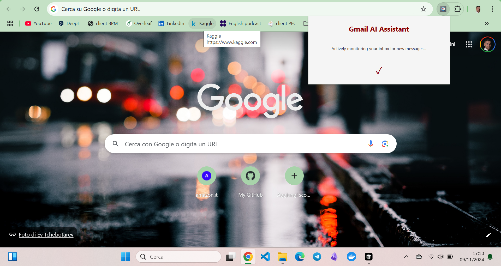

# Gmail Summarizer AI

If you, like me, are tired of receiving very long emails at work from clients or co-workers, then maybe this chrome extension is for you.
The extension performs a single, clear function: it checks every few seconds if there are new incoming emails to your Gmail mail account and sends you a notification with a 150-character, AI-made summary.
You could disable Gmail notifications since once you click the Mail Summarizer AI notification, you will be redirected to the original email page.

## Installation
- `git clone https://github.com/giuseppe-coco/mail-summarizer.git`

- Get a your_chrome_extension_id creating a new extension from https://chrome.google.com/webstore/devconsole/

- Get a your_oauth_client_id following this guide: https://developers.google.com/identity/oauth2/web/guides/get-google-api-clientid

- Get a your_openai_api_key from https://platform.openai.com/api-keys

- Replace the variables in manifest.json and service_worker.js

- Go in Chrome --> Extension --> Enable *developer mode* --> clicke *Add unpacked extension* --> Chose the folder *gmail-summarizer-ai/*

- Click the extension from the Extension tab in the toolbar

- Click the big button to give access to the app to your email in read mode.

App is running! It notifies you with a notfication including summary every time an email arrives to your inbox.

## Example

## Next Steps
### Using Google Gemini Nano running on local browser for summarization
This API is currently under experiments and it's not documented yet. 
But if the question interest you, you could open an issue.

### Integration with Firefox
Please open an issue

### Integration with other mail server providers.
Please open an issue
